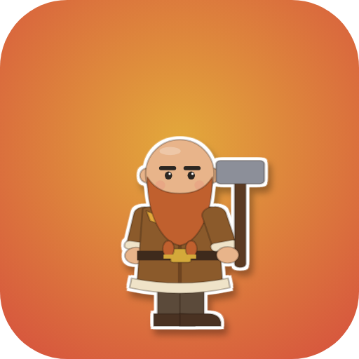
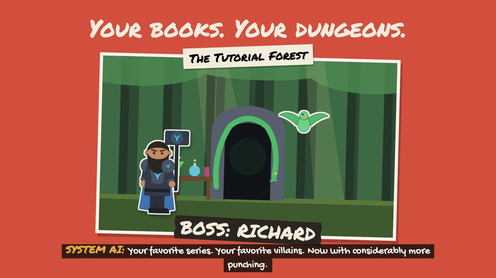
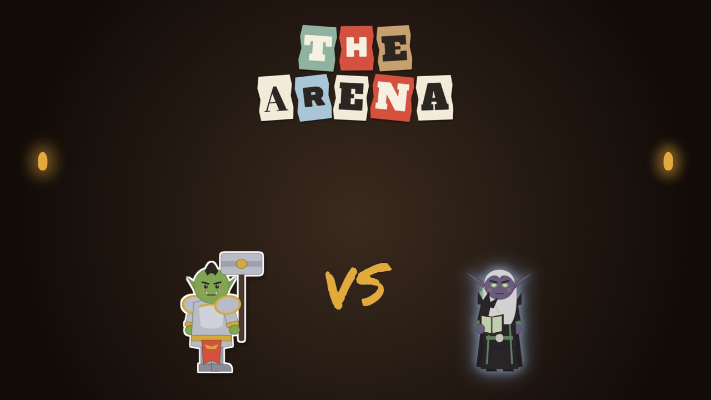
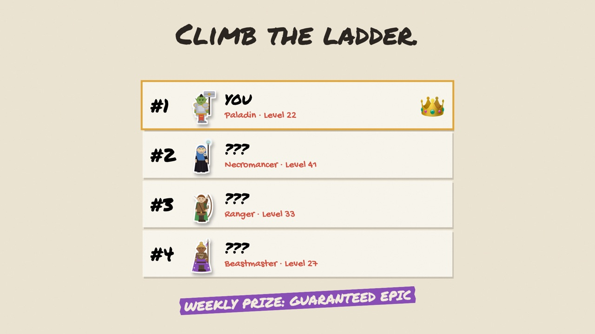
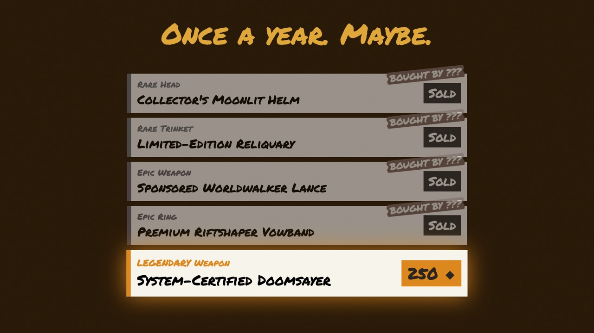

<p align="center"></p>

# The Listening Dungeon

**Every audiobook you finish becomes a dungeon you can play.**

A self-hosted game for [Audiobookshelf](https://www.audiobookshelf.org/) households. It reads what your family listens to and turns it into a paper-cutout dungeon crawler: finish a book, a dungeon unlocks; clear it for XP and loot; finish a whole series for bonus rewards. Built for a family of LitRPG fans, so it leans that way, but every monster, item and theme can be changed.



## What's in it

- **Your books are the dungeons.** Every finished book unlocks a three-floor dungeon. Longer books drop better loot; dungeon scenery follows the book's genre, and many popular series have their own look and villain.
- **Seven classes:** Brawler, Paladin, Runeblade, Hexcaster, Ranger, Beastmaster (pets) and Necromancer (minions), each with its own powers. Level up, collect gear, upgrade in the Forge, dress up in the Wardrobe.
- **The Arena:** fight the *ghost* of another player's crawler (their real stats and gear), climb the ladder, win weekly prizes.
- **The System Store:** a daily, shared shop. If someone buys it first, it's gone. Once in a while, a Legendary.
- **December party boss:** one shared health bar for the whole household, with banners, scars and consequences if he escapes.
- **Reading extras:** series rewards, badges, Tier Lists, Recommendations from your own tastes, a Chronicle of everything you've listened to, Release Radar for new books in your series, and book Requests.
- **Make it yours:** an admin Workshop to build or import monsters and loot, and a Monster Maker players can submit to.

| | |
|---|---|
|  |  |
|  | |

<details>
<summary><b>Full feature list</b></summary>

### Getting in
- Each player picks their Audiobookshelf user on the title screen and sets a 4-digit PIN the first time (wrong guesses lock out for a while).
- The title screen shows everyone's crawler, level, and what they're listening to right now (tap it for the book).
- **Build your crawler:** 5 ancestries (Human, Dwarf, Elf, Dark Elf, Orc), skin, hair and color, beard, face, accent color, or randomize.
- **7 classes**, each with its own power menu:
  - **Brawler** (Rage): Haymaker, Body Blow, Second Wind.
  - **Paladin** (Judgements): Smite, Holy Strike (double vs undead), Lay on Hands.
  - **Runeblade** (Runes): Rune Burst, Greater Burst, OVERCHARGE.
  - **Hexcaster** (Hexes): Soul Drain, Wither, Detonate.
  - **Ranger:** an opening shot plus Volley (one arrow per energy).
  - **Beastmaster:** call a wolf, hawk or bear, then Pack Attack, Murder of Crows or Hibernate.
  - **Necromancer** (Raise Dead): skeletons, ghouls and wraiths.
- Change your look or class later (costs bookmarks after the first time; changing class mid-dungeon restarts it with no penalty).
- A first-time **How to play** tour, reopenable any time.

### Dungeons
- **Every book you finish is a dungeon**, including everything finished before you installed it. Sort your shelf by newest, longest or random; tabs for Waiting, Fallen and Cleared.
- **Three floors of doors:** monsters, elites, loot boxes, shrines (heal), traps, and random sponsor gifts from the System. At the bottom, fight the floor boss for better loot or take the stairs.
- **Scenery follows the book:** genre themes (crypts, space stations, cultivation sects, ruined cities, VR servers…) and custom looks with named villains for 40+ popular series.
- Difficulty scales with your level *and* your gear, so every book is a fair fight. Elites and bosses can never be one-shot.
- **Boons** after beating an elite (Second Breakfast, Iron Skin, Keen Eye, Last Stand, Vampire Fangs, Spiked Coat, Gas Station Coffee).
- **Supplies** you pack automatically: Extra Potion, Lantern (see behind both doors), Smoke Bomb (escape a fight), Lucky Coin (roll a chest twice).
- **Auto battle** (unlocks at level 5) for regular and elite fights; floor bosses are fought by hand.
- Leave between rooms and pick up later. Fall, and the book goes to your **Fallen** shelf; revive it with bookmarks.

### Loot and gear
- Five rarities (Common to Legendary), six slots (Weapon, Head, Chest, Neck, Ring, Trinket), ~3,600 item icons.
- **Item levels:** gear is stamped with your level when it drops, so new loot keeps up with you.
- Longer books drop better loot; 20+ hour books give two chests. Legendaries are rare: an Epic has a small chance to upgrade.
- **The bag:** drag-and-drop or tap, stat previews, lock favorites, scrap the rest for bookmarks, and a **Best gear** button that equips the strongest set for your class. A ▲ marks real upgrades.

### Bookmarks (the currency)
- Earned from dungeons, finishing books, badges, completing series, ranking your Tier List, and Arena wins.
- **The Forge:** permanent upgrades: Thick Skin (health), Whetstone (attack), Iron Hide (defense), Scholar (XP), Lucky Find (loot), Field Medic (potions), Battle Ready (start fights with energy), and a Bigger Bag.
- **The System Store** (opens after 10 clears): 5 store-only items a day, shared by the whole household (first come, first served), a very rare Legendary, Mystery Crates, and supplies.
- **The Wardrobe:** titles, nameplate colors, capes and pet skins.
- **Revives** for fallen books.

### Series and rewards
- **Series complete:** clear every book in a series for 5 bookmarks per book, plus a guaranteed Epic for series of 5+ books. Catching up on new books pays again.
- **45 badges** across Progress, Skill, Reading, Class, Economy, Arena, Boss and Silly (e.g. Teetotaler, Tutorial Casualty, It's Orange!), each worth bookmarks.

### Playing together
- **Party page:** everyone's crawler with level, stats and gear, ranked; tap a friend's gear to see how it compares with yours. A live **party feed** of clears, loot, badges and duels.
- **The Arena:** fight the ghost of another player's crawler (their real stats, gear and class moves). Beat someone above you to take their spot on the ladder. 3 challenges a day; weekly prizes for #1 (an Epic) and the most wins (a Rare); a monthly Arena Champion.
- **December party boss, the Null Regent:** one shared health bar for the whole household, one attack a week plus Christmas, Boss Battle Banners anyone can raise for everyone, and consequences if he escapes (he returns next year, monsters get stronger until the household cleanses it, and a scar badge).

### More to do
- **Training grounds:** practice runs at any difficulty and theme, no rewards, no risk.
- **Monster Bestiary:** every monster you've met.
- **Monster Maker:** players design their own monster (body, head, colors, moves, even a boss); the admin approves it and it starts appearing in dungeons.
- Generated music and sound effects (off by default).
- Made for phones first; works on any browser.

### Reading pages
- **Chronicle:** your full listening history.
- **Stats:** listening numbers.
- **Tier List:** rank every series you've finished (and earn bookmarks for it).
- **Recommendations:** suggestions from your own ratings and tags, with an "add the series to my ABS playlist" button.
- **Release Radar:** watches Audible for new books in your series.
- **Requests:** ask for a series to be added to the library.

### For the admin (`/admin`)
- **Monster Workshop:** build monsters by hand or import a batch (an AI prompt in [docs/MONSTER_PROMPT.md](docs/MONSTER_PROMPT.md) writes them for you), tie them to a series, approve or edit player-built monsters.
- **Loot editor** for the item catalog.
- Request queue, Release Radar controls, and maintenance tools.
- Admin login with lockout; admin pages can be kept home-network-only behind a proxy.

</details>

## How it works

Two containers:

| Container | What it does |
|---|---|
| `listening-dungeon-abs-stats` | Talks to your Audiobookshelf server: finished books, listening time, series, covers. It only **reads**, except when a player taps "add this series to my playlist" on the Recommendations page. |
| `listening-dungeon` | The game and its pages. Keeps its own SQLite database in `/data`. |

Nothing about your listening leaves your network. The server looks up public book info on Audible and Royal Road (Release Radar, Requests, series tags for Recommendations), and the pages load fonts from Google Fonts.

## Install

You need an Audiobookshelf **admin API token**: in ABS go to *Settings → Users → (your admin user)* and copy the API token.

The easiest way to get your settings right is the **setup builder**: download [`tools/setup-builder.html`](tools/setup-builder.html), open it in your browser, fill it in, and download ready-made Unraid templates, a Docker `.env`, or a Portainer stack. It runs entirely in your browser.

### Unraid

1. Put the two templates from the setup builder (or [`templates/unraid/`](templates/unraid/)) in `/boot/config/plugins/dockerMan/templates-user/` (the **flash** share).
2. Docker → **Add Container** → pick **listening-dungeon-abs-stats** → fill in your ABS address and token → Apply.
3. Docker → **Add Container** → pick **listening-dungeon** → set the admin password and the abs-stats address → Apply.
4. Open `http://<your-server>:8000`.

On the default bridge network the containers reach each other by your server's IP (e.g. `http://192.168.1.50:3000`). If you put both on a custom Docker network you can use container names instead.

### Docker / Docker Desktop

```bash
git clone https://github.com/yxqzme2/listening-dungeon.git
cd listening-dungeon
cp .env.example .env      # then fill it in (or use the setup builder)
docker compose up -d
```

Open `http://localhost:8000` (or the machine's IP).

### Portainer

Stacks → Add stack → paste the stack from the setup builder → Deploy.

## Playing from outside your home

The game is plain HTTP on port 8000. To play away from home, put it behind something you trust: a VPN (Tailscale, WireGuard) is simplest and safest, or a reverse proxy with HTTPS. See [docs/reverse-proxy.md](docs/reverse-proxy.md). Don't forward port 8000 straight to the internet.

## First steps

- Each player picks their ABS username on the title screen and sets a 4-digit PIN the first time.
- Admin pages live at `/admin` (the password you set). From there: build or import monsters (see [docs/MONSTER_PROMPT.md](docs/MONSTER_PROMPT.md) for an AI prompt that writes them for you), edit loot, approve player-made monsters, run Release Radar.
- Books finished before you installed it show up as dungeons too, so nobody starts empty-handed.

## Updating

- **Unraid:** Docker → *Check for updates* → update both.
- **Docker:** `docker compose pull && docker compose up -d`.

Your `/data` folder (database, covers) is kept. Back it up now and then.

## Modding

The whole thing was built with Claude (Anthropic's AI) and is meant to be easy to change: point Claude Code (or your AI of choice) at this repo and describe what you want. Good starting points:

- `app/game_rules.py`: every number (XP, loot odds, prices, scaling).
- `app/game_monsters.py`: the built-in monsters.
- `static/game/dungeon-themes.js`: dungeon scenery and the series looks (see [docs/SERIES_THEMES.md](docs/SERIES_THEMES.md)).
- `csv/loot.csv`: the item catalog.

Tests: `python -m unittest discover tests`.

## Feedback

Ideas, bugs and feature requests are welcome in [Issues](https://github.com/yxqzme2/listening-dungeon/issues). This is a family hobby project, so updates come when they come.

## License

[MIT](LICENSE). Item icons were gathered from around the web for this hobby project; if you own one and want it credited or removed, open an issue.
